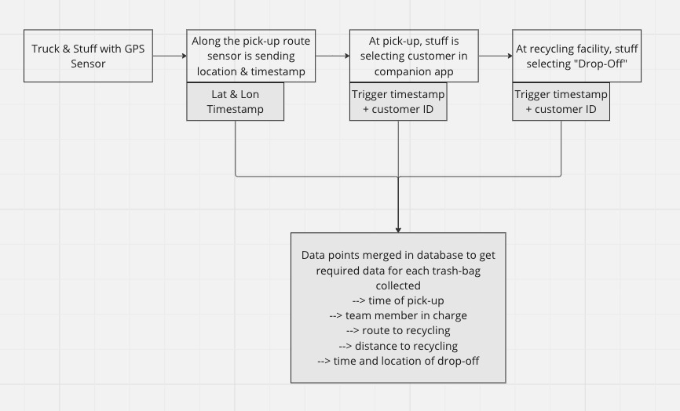

# BLCKxTAKA

[Taka Earth](https://www.taka.earth)
[BLCK IoT](https://www.blck-iot.com)

## Taka Earth Teams Up with BLCK IoT to Drive Environmental Sustainability using Blockchain Technology 

Taka Earth, a pioneering climate tech startup dedicated to documenting climate action in Africa, is thrilled to announce a strategic collaboration with BLCK IoT. This partnership aims to leverage the power of blockchain technology to enhance the verification of environmental sustainability efforts.

Taka Earth firmly believes that by joining forces with BLCK IoT, they can harness the potential of LoRaWAN, which offers advantages such as extended battery life and transmission distances, although with a trade-off of longer latency and smaller packet sizes. By incorporating LoRaWAN networks into their waste capture tracking and recycling documentation, Taka Earth ensures that all their environmental sustainability efforts become verifiable and transparent.

BLCK IoT, a company dedicated to decentralizing wireless networks for a sustainable future, specializes in developing custom solutions that make a positive impact on the planet. Their mission is to assist businesses and organizations in leveraging innovative technology to address pressing global challenges such as climate change, conservation, and regenerative finance. BLCK IoT's expertise lies in creating solutions that promote sustainability, reduce carbon emissions, and encourage environmental stewardship.

## Phase 1
The first aspect of the collaboration involves tracking waste pick-ups on the blockchain, enabling Taka Earth to quantify and provide verifiable communication of their clients' sustainable waste capture efforts, both over long distances and within buildings. This digital ledger will be enriched with verifiable location data, ensuring transparency in tracking all greenhouse gas emission reduction efforts.

### How are we achieving this?

BLCK already deployed 60 Helium (LoRaWan) Gateways in Kenya. Helium is a decentralized wireless network on Solana.

### Current Status

One team is doing runs (*explain run*) with a GPS tracker. This helps us to map coverage in Nairobi (*add mapper link*).

### Tech Stack

- LoRaWan GPS nodes
- Helium Gateways
- LNS
- MQTT (StreamR)
(*can we use this to also get attention from StreamR?*)

### Next Steps

- setup missing coverage
- Integrate data stream with Taka backend

*Need to discuss how we want to make location data verifiable.*

## Phase 2
The second aspect focuses on enhancing reporting for sustainable waste management by creating a recycling ledger that digitizes and hashes the existing value chain of recycling activities for tokenization. This step is essential for Taka Earth's goal of recording, measuring, and reporting every waste collection, ultimately accounting for these carbon stocks as financial assets, with a focus on Regenerative Finance (ReFi).

